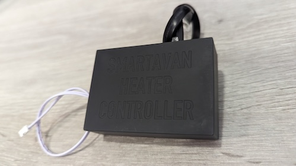
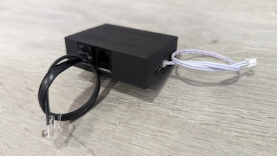

# Smartavan Heater Controller

This repository contains ESPHome config for Smartavan heater controller.

Device itself is connected between Truma CP Plus (this or newer "iNET READY" control panel is required).

It is used to control Truma/Alde and other possibly supported RV heaters (and ACs).

Thanks to @Fabian-Schmidt for creating [custom component](https://github.com/Fabian-Schmidt/esphome-truma_inetbox) which enables communication with the heater.
